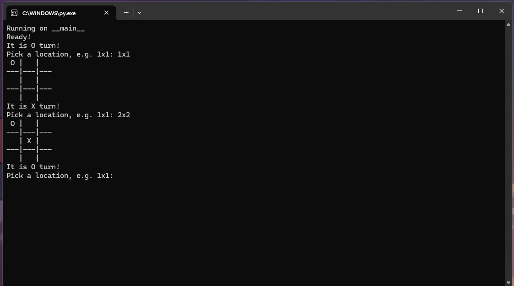

# Better TicTacToe

This is an unlisensed project, feel free to copy, modify, seel and compile the project as stated in the [License](LICENSE) file. This is a fun little project that I made in 3 hours. This is a console based project; where two players can competively play TicTacToe. _That's it_.

An example of the program on a console

## Notes

The game doesn't actually delete `system32`; _just look at the [code](main.py)_.

This only works on a 3 by 3 grid (Add a board checking baking system).

Planning on an AI that can play TicTacToe with you.

## Credits

- _Blockitifluy_ - Me
- _You_ - ¯\\\_(ツ)\_/¯

The cleanest code I have ever made
